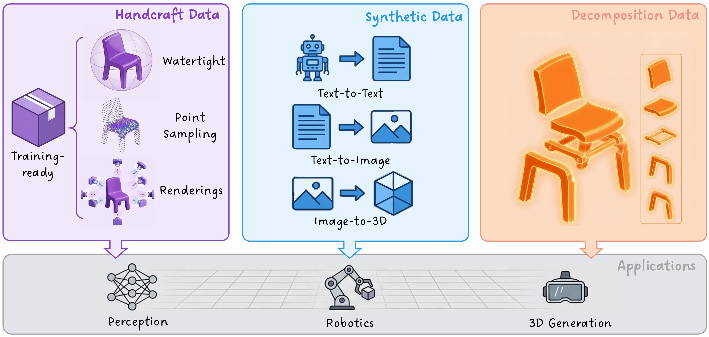

<p align="center">
  
</p>


<div align="center">
  <a href=https://3d.hunyuan.tencent.com target="_blank"></a>
  <a href=https://huggingface.co/datasets/tencent/HY3D-Bench target="_blank"></a>
  <a href=https://huggingface.co/tencent/HY3D-Bench target="_blank"></a>
  <a href=https://3d-models.hunyuan.tencent.com/ target="_blank"></a>
  <a href=https://discord.gg/dNBrdrGGMa target="_blank"></a>
  <a href=https://arxiv.org/pdf/2602.03907 target="_blank"></a>
  <a href=https://x.com/TencentHunyuan target="_blank"></a>
 <a href="#community-resources" target="_blank"></a>
</div>

## 🔥 News
- **Feb 04, 2026**: 🎉 We release **HY3D-Bench** - a comprehensive collection of high-quality 3D datasets with 3 DIFFERENT subsets!
  - ✨ **Full-level Dataset**: 252K+ watertight meshes with multi-view renderings and sampled points
  - ✨ **Part-level Dataset**: 240K+ objects with fine-grained part decomposition
  - ✨ **Synthetic Dataset**: 125K+ AI-synthesized objects across 1,252 categories
  - 🚀 **Baseline Model**: Hunyuan3D-Shape-v2-1 Small (0.8B DiT) trained on our Full-level data

> Join our **[Wechat](#)** and **[Discord](https://discord.gg/dNBrdrGGMa)** group to discuss and find help from us.

| Wechat Group                                     | Xiaohongshu                                           | X                                           | Discord                                           |
|--------------------------------------------------|-------------------------------------------------------|---------------------------------------------|---------------------------------------------------|
|  |  |  |  |    


---
## ☯️ **HY3D-Bench**
**HY3D-Bench** is a collection of high-quality 3D datasets designed to address the critical limitations of existing 3D repositories. While pioneering large-scale datasets have provided unprecedented volumes of 3D data, their utility is often hampered by significant noise, non-manifold geometry, and lack of structural granularity.

We release **three complementary datasets** that provide clean, structured, and diverse 3D content for research in computer vision, generative modeling, and robotics.

## 🎯 Key Features Across All Datasets

✅ **Training-Ready Quality**: All meshes are watertight, normalized, and cleaned  
✅ **Standardized Format**: Consistent file formats and metadata structure  

### 🔷 **Full Dataset** - Complete Objects with Watertight Meshes
High-quality holistic 3D objects processed through a professional pipeline to ensure training-ready quality.

**What's Included:**
- **Watertight meshes** for each object (no holes, manifold geometry)
- **High-fidelity multi-view renderings** (RGB images from standardized camera poses)
- **Cleaned and normalized geometry** ready for stable 3D generation training

**Use Cases:**
- Training 3D generative models (diffusion, GAN, autoregressive)
- 3D reconstruction benchmarks
- Single-view to 3D tasks
- Geometric deep learning

**Instructions for Use**
For detailed usage, see [baseline/README.md](baselines/README.md) and [debug_dataloader.py](baselines/debug_scripts/debug_dataloader.py)

### 🔷 **Part Dataset** - Structured Part-Level Decomposition
Objects with consistent part-level segmentation and individual part assets.

**What's Included:**
- **Original mesh segmentation results** (part labels)
- **Individual part-level watertight meshes** (each part as separate clean mesh)
- **Part-assembly RGB renderings** (view-dependent images of assembled parts)

**Use Cases:**
- Part-aware 3D generation
- Fine-grained geometric perception
- Part-based shape analysis
- Robotics manipulation (affordance learning, grasp planning)

**Instructions for Use**
For detailed instructions, see [Part_README.md](part-level_data/Part_README.md)

### 🔷 **Sythetic Dataset** - AI-Synthesized Long-Tail Objects
Scalable AIGC-driven synthetic data covering rare and diverse categories.

**What's Included:**
- **20 super-categories, 130 categories, 1,252 fine-grained sub-categories**
- **Text-to-3D pipeline outputs** (LLM → Diffusion → Image-to-3D reconstruction)
- **Long-tail object coverage** (rare items, specialized categories)

**Use Cases:**
- Training robust models on diverse categories
- Data augmentation for underrepresented classes
- Zero-shot generalization evaluation
- Robotics simulation environments (diverse object libraries)

**Generation Pipeline:**
1. **Text-to-Text**: Semantic expansion using Large Language Models
2. **Text-to-Image**: Visual synthesis via Diffusion Models  
3. **Image-to-3D**: Textured Mesh generation with the most advanced 3D Generative Model

---
## 📥 Download
[🤗 Hugging Face](https://huggingface.co/datasets/tencent/HY3D-Bench)

```
# Download entire dataset
hf download tencent/HY3D-Bench --repo-type dataset --local-dir "your/local/path"

# Download specific subset, e.g. full. 
hf download tencent/HY3D-Bench --repo-type dataset --include "full/**" --local-dir "your/local/path"
```

| Dataset | Objects | Size |
|---------|---------|------|
| **Full-level** | 252K+ | ~11 TB | 
| **Part-level** | 240K+ | ~5.0 TB |
| **Synthetic** | 125K+ | ~6.5 TB | 

### Dataset Structure
```
HY3D-Bench/
├── full/
│   ├── test/      
│   │   ├──images
│   │   ├──sample_points
│   │   └──water_tight_meshes       
│   ├── train/                 # same subsets as test
│   └── val/                   # same subsets as test
├── part/
│   ├── images/                # rendering   
│   └── water_tight_meshes     # meshes
└── synthetic/
    ├── glb/                   # AI-generated meshes storaged with glb format files
    └── img/                   # The condition images used to generate meshes
```

---
## 🎁 Baseline Model

We train a baseline model `Hunyuan3D-Shape-v2-1 Small` with the full-level data to evaluate the effectiveness of the full-level dataset.


| Model | Date | Size | Huggingface |
|-------|------|------|-------------|
| Model_2048tokens | 2026-02-04 | 0.8B | [Download]() |
| Model_4096tokens | 2026-02-04 | 0.8B | [Download]() |


## 🔗 BibTeX

If you found this repository helpful, please cite our reports:

```bibtex

@misc{hunyuan3d2026hy3dbenchgeneration3dassets,
      title={HY3D-Bench: Generation of 3D Assets}, 
      author={Team Hunyuan3D and : and Bowen Zhang and Chunchao Guo and Dongyuan Guo and Haolin Liu and Hongyu Yan and Huiwen Shi and Jiaao Yu and Jiachen Xu and Jingwei Huang and Kunhong Li and Lifu Wang and Linus and Penghao Wang and Qingxiang Lin and Ruining Tang and Xianghui Yang and Yang Li and Yirui Guan and Yunfei Zhao and Yunhan Yang and Zeqiang Lai and Zhihao Liang and Zibo Zhao},
      year={2026},
      eprint={2602.03907},
      archivePrefix={arXiv},
      primaryClass={cs.CV},
      url={https://arxiv.org/abs/2602.03907}, 
}

@article{ma2025p3sam,
  title={P3-sam: Native 3d part segmentation},
  author={Ma, Changfeng and Li, Yang and Yan, Xinhao and Xu, Jiachen and Yang, Yunhan and Wang, Chunshi and Zhao, Zibo and Guo, Yanwen and Chen, Zhuo and Guo, Chunchao},
  journal={arXiv preprint arXiv:2509.06784},
  year={2025}
}

@article{yan2025xpart,
  title={X-Part: high fidelity and structure coherent shape decomposition},
  author={Yan, Xinhao and Xu, Jiachen and Li, Yang and Ma, Changfeng and Yang, Yunhan and Wang, Chunshi and Zhao, Zibo and Lai, Zeqiang and Zhao, Yunfei and Chen, Zhuo and others},
  journal={arXiv preprint arXiv:2509.08643},
  year={2025}
}

@misc{hunyuan3d2025hunyuan3domni,
      title={Hunyuan3D-Omni: A Unified Framework for Controllable Generation of 3D Assets}, 
      author={Tencent Hunyuan3D Team},
      year={2025},
      eprint={2509.21245},
      archivePrefix={arXiv},
      primaryClass={cs.CV},
      url={https://arxiv.org/abs/2509.21245}, 
}

@misc{hunyuan3d2025hunyuan3d,
    title={Hunyuan3D 2.1: From Images to High-Fidelity 3D Assets with Production-Ready PBR Material},
    author={Tencent Hunyuan3D Team},
    year={2025},
    eprint={2506.15442},
    archivePrefix={arXiv},
    primaryClass={cs.CV}
}

@misc{hunyuan3d22025tencent,
    title={Hunyuan3D 2.0: Scaling Diffusion Models for High Resolution Textured 3D Assets Generation},
    author={Tencent Hunyuan3D Team},
    year={2025},
    eprint={2501.12202},
    archivePrefix={arXiv},
    primaryClass={cs.CV}
}

@misc{yang2024hunyuan3d,
    title={Hunyuan3D 1.0: A Unified Framework for Text-to-3D and Image-to-3D Generation},
    author={Tencent Hunyuan3D Team},
    year={2024},
    eprint={2411.02293},
    archivePrefix={arXiv},
    primaryClass={cs.CV}
}
```

## Acknowledgements

We would like to thank the contributors to the [Hunyuan3D-2.1](https://huggingface.co/tencent/Hunyuan3D-2.1), [TripoSG](https://github.com/VAST-AI-Research/TripoSG), [Trellis](https://github.com/microsoft/TRELLIS),  [DINOv2](https://github.com/facebookresearch/dinov2), [FLUX](https://github.com/black-forest-labs/flux), [diffusers](https://github.com/huggingface/diffusers), [HuggingFace](https://huggingface.co), [CraftsMan3D](https://github.com/wyysf-98/CraftsMan3D), [Michelangelo](https://github.com/NeuralCarver/Michelangelo/tree/main), [Hunyuan-DiT](https://github.com/Tencent-Hunyuan/HunyuanDiT), and [HunyuanVideo](https://github.com/Tencent-Hunyuan/HunyuanVideo) repositories, for their open research and exploration.
